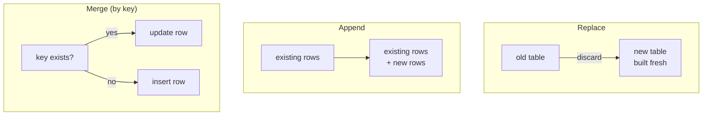

Ingestion is the E and L of the story: getting data *out* of systems that were never designed
to give it up, and putting it *down* somewhere without losing, duplicating, or mangling it.
It's the least glamorous layer of the platform and the one where most real-world failures
happen - sources are the part of a pipeline you don't control.

## Connectors: one adapter per kind of source

You could write custom code for every source. The second time you do it, you'll notice
you're solving the same problems again: connect, authenticate, page through results, retry
on hiccups, map the source's types to yours. A **connector** packages those solutions per
*kind* of source - one for Postgres, one for SQL Server, one for local files, one for S3 -
so adding a source becomes configuration:

```yaml
shop_db:
  connector: postgres
  host: db.sunrisebakery.com
  database: shop
```

Think of connectors as power adapters: the wall sockets differ by country, the appliance
doesn't care. Every serious pipeline tool is, in large part, a connector collection plus the
machinery to run them.

## Extracting from databases

The straightforward part: databases speak SQL, so extraction is a query. The craft is in not
hurting the source:

- **Extract off-peak** - the 06:00 batch slot exists because 06:00 is quiet.
- **Extract incrementally** (Chapter 3): `WHERE updated_at > <watermark>` turns a
  million-row scan into a thousand-row read. The watermark must be stored durably between
  runs, and it should only advance **after** the data it covers is safely delivered - if you
  advance it and then crash before writing, those rows are simply gone. This
  ordering - *deliver first, then advance* - is one of the classic subtle bugs of ingestion.
- **Split big extractions into partitions** - four parallel readers each taking a slice of
  the ID range finish faster and hold shorter locks than one giant query.
- **Push work down.** If the pipeline only needs three columns and last week's rows, ask the
  source for exactly that instead of dragging everything across the network and filtering
  later. This is called **pushdown** (of projections - columns - and predicates - filters),
  and good tools do it for you.

## Extracting from APIs

SaaS tools hand you HTTP endpoints instead of SQL, and three realities come with them:

- **Pagination.** APIs return results a page at a time (`?page=7` or a "next" token). The
  extractor must loop until the pages run out - and cope with data changing *while* it pages.
- **Rate limits.** The provider will throttle you ("429 Too Many Requests - retry after 30
  seconds"). Polite extractors slow down and resume rather than hammering on.
- **Shape.** You get nested JSON, not tables. Part of ingestion is flattening
  `customer.address.city` into columns.

APIs fail more than databases - timeouts, 500s, maintenance windows. Which brings us to the
most important behavior in this chapter.

## Retries, and the difference between hiccups and bugs

Failures come in two species, and they deserve opposite treatment:

- **Transient** failures - a timeout, a dropped connection, a rate limit - fix themselves.
  The right response is to wait and retry, with growing pauses (2s, 4s, 8s - *exponential
  backoff*) so a struggling source gets air instead of a stampede.
- **Permanent** failures - bad credentials, a table that doesn't exist, malformed config -
  will fail identically every time. The right response is to stop immediately and tell a
  human, loudly and specifically.

A pipeline that retries permanent errors wastes hours before failing anyway; one that
doesn't retry transient errors pages a human at 3 a.m. for a 10-second network blip.
Distinguishing the two - and capping retries so a *persistently* transient failure (a source
that's down all night) eventually stops burning the budget - is table stakes for ingestion.

## File formats: how data travels and rests

Extracted data has to be written down somehow. Three formats cover almost everything:

| Format | What it is | Best at | Watch out for |
|---|---|---|---|
| **CSV** | Plain text, one row per line | Universal exchange - everything reads it | No types: `007` and `2026-03-01` are just strings; commas and quotes inside values bite |
| **JSON** | Nested text records | API payloads, irregular shapes | Verbose; still typeless-ish |
| **Parquet** | Binary, columnar, compressed | Analytics: small files, fast scans, real types | Not human-readable |

Rule of thumb: **accept CSV and JSON at the edges** (they're what sources give you), **store
in Parquet** once data is yours. A Parquet file is routinely 5–10× smaller than the same CSV
and far faster to query, because readers can grab single columns and skip whole chunks.

## Schema drift: sources change without asking

One Tuesday the shop's developers rename `amount` to `total_amount` and add a `channel`
column. Nobody tells the data team - nobody ever tells the data team. This is **schema
drift**, and ingestion sits directly in the blast radius.

The spectrum of responses, from strict to loose:

- **Fail loudly** on any unexpected change. Safest default: wrong-but-obvious beats
  wrong-but-silent, which is the villain of this whole book.
- **Tolerate additions** (new columns flow through or are ignored) but fail on removals and
  type changes - a pragmatic middle.
- **Auto-adapt** to everything. Comfortable until the day a renamed column silently becomes
  a column of NULLs feeding a correct-looking, wrong dashboard.

Whichever you choose, choose it *explicitly*, per source. Declaring expected columns and
types up front is what turns drift from a silent corruption into a clear morning error.

## Loading: the three strategies

Getting data *in* looks trivial - write the rows - until a run fails halfway or runs twice.
Then the **load strategy** decides whether you're fine or double-counted:

- **Replace** (full refresh's partner): delete the old, write the new - atomically, so
  readers never see a half-written table (the classic trick: write to the side, then swap).
  Run it twice and nothing is harmed.
- **Append**: add new rows to the end. The natural partner of incremental extraction - and
  the dangerous one, because a retried run appends *again*. Ask what happens if the same
  batch arrives twice **before** choosing append.
- **Merge** (also called *upsert*): the smart middle. Each incoming row either updates the
  existing row with the same **key** (`order_id`) or inserts a fresh one. Run it twice and
  the second pass overwrites rows with identical values - harmless.



## Delivery guarantees: the honest vocabulary

How sure are you that each source row ends up in the destination exactly once? Three levels:

- **At-most-once**: never duplicated, but may be lost. (Fire and forget.)
- **At-least-once**: never lost, but may be duplicated - this is what retries naturally give
  you. Appending with retries is at-least-once.
- **Exactly-once**: never lost, never duplicated - and, in its pure form, famously
  impossible to fully guarantee across independent systems that can each crash mid-step.

The practical resolution is **effectively-once**: allow redelivery (at-least-once) but make
the *load* idempotent so duplicates are harmless. Merge and replace do exactly this - the
second delivery of order 8231 just overwrites order 8231. This one idea - *retry freely,
load idempotently* - is the closest thing ingestion has to a golden rule, and it's why
serious tools make you consciously opt in before pairing incremental extraction with a
plain append.

## Sunrise Bakery's ingestion, assembled

Nightly at 06:00: the Postgres connector pulls orders incrementally on `updated_at`
(watermark advanced only after the night's loads commit), the CRM and payments connectors
page through their APIs with backoff-and-retry, everything lands as raw Parquet in dated
folders, and the analytics tables are loaded with *replace* (small tables) and *merge on
`order_id`* (orders). A retried run changes nothing but timestamps. That's the whole
chapter in one paragraph.

## The takeaway

- Connectors turn source-wrangling into configuration; be gentle with sources - extract
  incrementally, push filters down, back off when throttled.
- Retry transient failures with backoff; fail fast and loud on permanent ones.
- Land raw data, prefer Parquet at rest, and decide your schema-drift posture explicitly.
- Choose the load strategy by asking "what if this ran twice?" - merge and replace shrug;
  append double-counts.
- Aim for effectively-once: at-least-once delivery on top of idempotent loads.

---

*Next: [Chapter 5 - Transforming data](../05-transforming-data/)*
