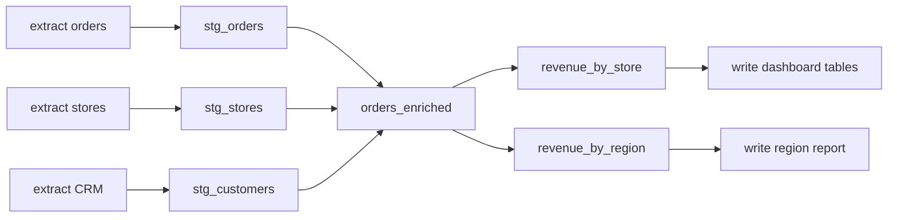

Chapter 5 left us with a pile of small, well-behaved SQL steps. Now someone has to run
them - in the right order, at the right time, restarting the right pieces when something
fails. That job is **orchestration**, and it's the difference between "a folder of scripts"
and "a system."

## Order is not optional

Think about cooking from a recipe: you can chop the onions and preheat the oven in either
order (or at the same time), but you cannot frost the cake before baking it. Steps have
*dependencies*, and dependencies are one-directional.

Sunrise Bakery's steps are the same. `stg_orders` can't run until raw orders are extracted;
`orders_enriched` needs *all three* staging tables; the two revenue marts need
`orders_enriched`; the dashboard tables shouldn't be written until their mart is built. Run
them out of order and you get, at best, a crash - at worst, a report quietly built from
yesterday's half of the data.

## The DAG: the shape of every pipeline

Write down each step as a dot and each "must finish before" as an arrow and you get the
central object of orchestration: a **directed acyclic graph**, or **DAG**.

- **Directed**: arrows point one way - from producer to consumer.
- **Acyclic**: no loops. If A needs B and B needs A, nothing can ever start. A cycle in a
  pipeline definition is always a bug, and good tools refuse it outright.
- **Graph**: dots and arrows.

The DAG earns its keep three ways:

1. **Correct order, computed not memorized.** The orchestrator sorts the graph
   (*topological order*) so every step runs only after its dependencies. Nobody maintains a
   fragile numbered list; add a step and its arrows, and the order updates itself.
2. **Free parallelism.** The three extractions share no arrows, so they can run
   *simultaneously*. The graph exposes exactly what's parallelizable - no analysis needed.
3. **Surgical failure handling.** If `stg_stores` fails, the orchestrator knows precisely
   what's downstream of it (`orders_enriched` and everything after - skip) and what isn't
   (`stg_orders`, `stg_customers` - carry on fine). One bad step no longer poisons the
   whole night.

## Where does the DAG come from?

Two schools:

- **Declare it by hand**: a config file listing "task A, then B, then C." Explicit, but it
  *drifts* - you edit the SQL to join a new table and forget to add the arrow, and the graph
  silently lies.
- **Derive it from the code**: each SQL step *names* its inputs - "I read from
  `stg_orders`" - and the tool assembles the graph from those references. The dependency
  can't drift because it *is* the code. This is the modern default (dbt's `ref()` made it
  famous; `pz` works the same way), and it's a big deal: the graph is always exactly as true
  as the SQL.

## Scheduling: when does it all start?

The scheduler answers *when*; the DAG answers *in what order*. Keep the two jobs separate in
your head - many teams run a very fancy DAG off a very plain scheduler, and that's healthy.

- **Cron** - the 50-year-old Unix scheduler ("at 06:00 daily, run this command") and its
  siblings (Windows Task Scheduler, systemd timers, a CI job on a timer). If your pipeline
  is *one command that internally runs the whole DAG*, cron-plus-that-command is a complete,
  honest orchestration setup for a small team.
- **Orchestration platforms** - Airflow, Dagster, Prefect and friends. These earn their
  operational cost when you outgrow one command: many pipelines with *cross-pipeline*
  dependencies, event-driven triggers ("run when the file arrives"), a UI for a team to
  watch and rerun things, per-task alerting.
- **Event triggers** - don't run at a time; run when something happens. Batch stays batch;
  only the starting gun changes.

The trap to avoid is resume-driven orchestration: installing a distributed scheduling
platform to run what is, honestly, one nightly command. Complexity is a cost you pay every
day; pay it when the pain arrives, not before.

## Failure is normal: retries, skips, and resumes

Orchestration's real job description is "what happens at 3 a.m. when step 7 of 12 dies."

- **Retries with backoff** (Chapter 4's logic, now applied per step): transient blips heal
  themselves before anyone wakes up. Cap the attempts; a source that's down all night
  should fail the step, not retry until sunrise.
- **Skip downstream, finish the rest**: everything not depending on the failure completes
  normally. Half a warm dashboard beats a cold one.
- **Resume from failure**: this is the feature to demand. When the CRM extraction died at
  step 9, rerunning the night should redo *step 9 and what follows* - not re-extract three
  sources and rebuild six tables that already succeeded. Tools that remember "what already
  landed safely" turn a 40-minute rerun into a 4-minute one, and remove all temptation to
  "just quickly patch it by hand" (the way pipelines get corrupted).
- **Concurrency limits**: parallelism is free *in the graph* but not *in the world* - eight
  simultaneous extractions can flatten a small source database. Good orchestration lets you
  cap how many steps hit one system at once.
- **A circuit breaker** for the truly bad night: if half the steps are failing, stop
  starting new ones. When the database is down, forty failure emails are not forty times
  more informative than one.

## Backfills, revisited

Chapter 3 said backfills should run as bounded slices. Orchestration is where that becomes
real: rebuilding 2024 means running the *same DAG* many times with different date windows -
January, then February, then March. The orchestrator's contribution is pacing (one slice at
a time, gently), retrying failed slices individually, and tracking which slices are done.
Same graph, different question.

## Sunrise Bakery, orchestrated

Their complete setup: every file from Chapter 5 declares what it reads, the tool derives the
DAG, and one crontab line - `0 6 * * * pipeline run` - starts the night. Extractions run in
parallel (capped at two against the shop database), a failed CRM pull retries twice with
backoff, and the morning after a real failure, one *resume* command redoes only what's
missing. Nobody maintains an order. Nobody reruns the world.

## The takeaway

- Dependencies form a DAG; the orchestrator sorts it, parallelizes the independent parts,
  and contains failures to their downstream cone.
- Derive the graph from the code's own references - hand-declared graphs drift.
- *When* (scheduler) and *in what order* (DAG) are separate jobs; cron plus a
  DAG-aware tool is a legitimate architecture, not a hack.
- Judge orchestration by its worst night: retries for blips, skips for containment,
  resume-from-failure for the morning after.

---

*Next: [Chapter 7 - Data validation and quality](../07-data-validation-and-quality/)*
