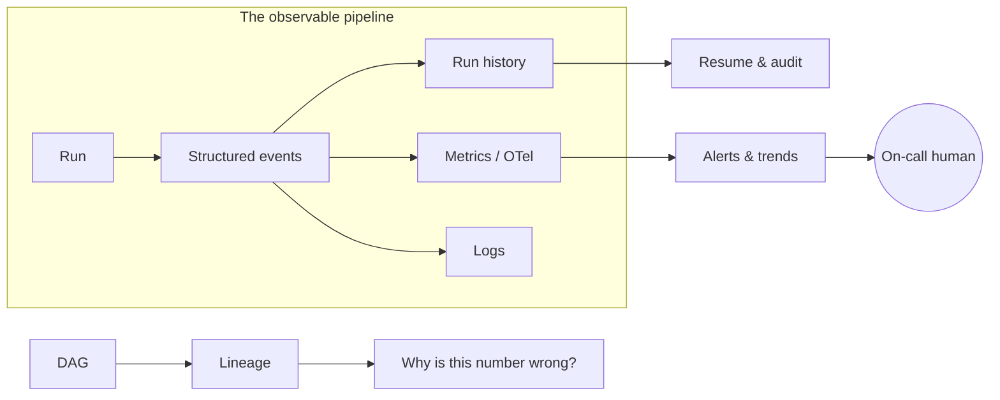

A pipeline you can't see is a pipeline you find out about from your users. Chapter 7 made
the *data* tell the truth; this chapter makes the *pipeline* tell the truth: did it run, did
it succeed, how long did it take, what exactly happened at 03:12 - and can you find out
*before* the owner opens a stale dashboard?

Two words, one distinction worth keeping:

- **Monitoring** answers known questions automatically: *is it up? did it fail? is it slow?*
  Smoke detectors.
- **Observability** is the property that lets you answer questions you *didn't* plan for:
  *why is Tuesday's revenue table missing the Berlin store?* The investigation kit.

You need both, and they're built from the same raw material.

## The raw material: events, logs, metrics

**Structured events** are the foundation. The difference from prose logs is the difference
between a diary and a ledger:

```
# prose - pleasant to read, awful to query
06:01:32 Loading orders... done! 4,812 rows, took 41s

# structured (NDJSON: one JSON event per line) - a machine can aggregate months of this
{"event":"node.completed","node":"src_shop__orders","status":"ok","rows":4812,"duration_ms":41210}
```

Emit structured events and every question becomes a query: average nightly duration, row
counts by week, failure rate by source. Prose can't do that, and 3 a.m. debugging shouldn't
depend on regexes over prose.

From events, three derived layers:

- **Run history** - a persisted record per run: what ran, node by node, with statuses, row
  counts, and timings. This is the pipeline's *memory*; Chapter 6's resume-from-failure is
  literally a query against it.
- **Metrics** - numbers over time (runs succeeded, rows moved, duration). Feed them to
  whatever your ops world already watches; the emerging lingua franca is **OpenTelemetry
  (OTel)**, a vendor-neutral standard that means your pipeline can report to Azure Monitor,
  Grafana, or Datadog without bespoke glue.
- **Logs** - the detailed prose, kept for the deep-dive after monitoring points at the
  right haystack.

## The questions that matter

Dashboards full of unread charts are decoration. Monitoring earns its keep by answering
four questions, in order of importance:

1. **Did it run at all?** The sneakiest failure is the run that never started - the server
   rebooted, the scheduler entry was lost. Nothing errored, so nothing alerted. The fix is a
   *heartbeat*: an expectation that fires when the nightly run *doesn't* check in by 06:30.
   You must monitor for absence, not just failure.
2. **Did it succeed?** The exit signal - and it should be honest and machine-readable.
   Distinguish at minimum: all good / some steps failed / configuration is broken. (Tools
   express this as exit codes; a scheduler can act on them without parsing anything.)
3. **Is the data fresh?** The run succeeding is not the same as the data being current -
   a run can "succeed" while extracting zero rows against a silently broken source
   (Chapter 7's freshness check, viewed from the ops side). Freshness is the metric your
   *stakeholders* actually feel.
4. **Is it drifting?** The 40-minute run that now takes 3 hours; row counts quietly
   doubling. Trends are the early-warning system for next month's incident.

## Alerting: the art of not crying wolf

The failure mode of alerting isn't too few alerts - it's too many. The team that receives
forty emails a night has, functionally, no alerting: the real failure scrolls past with the
noise. (Chapter 7's ignored-red-checks lesson, again, at system scale.)

Principles that survive contact with reality:

- **Alert on what someone will act on, at the urgency they'll act with.** Pipeline failed
  and the dashboard is stale → wake someone (or at least ping the team channel at 06:05).
  Runtime trending up → a weekly digest. Everything else → a dashboard nobody is forced
  to look at.
- **One incident, one alert.** The database being down is *one fact*, not fourteen node
  failures' worth of email. Chapter 6's circuit breaker is monitoring's best friend here.
- **Route by audience.** Engineers get the stack trace; stakeholders get "data delayed,
  yesterday's numbers shown, fix underway" - *in the dashboard itself*. A visible "data
  as of" timestamp is the cheapest, highest-value monitoring artifact in this chapter:
  it converts silent staleness into honest staleness.

## Lineage: the map for the unplanned question

**Lineage** is the record of what feeds what - Chapter 6's DAG, kept queryable after the
run. It's how the unplanned questions get answered fast:

- *Berlin's missing from Tuesday's revenue* → walk **upstream**: mart ← enriched ← staging
  ← extraction… and there it is, the store-API page that timed out.
- *We're changing the CRM's region field* → walk **downstream**: which tables, checks, and
  dashboards will feel it? Now the change ships with a list instead of a surprise.

Because the DAG was derived from the code (Chapter 6), lineage is free and always true -
one more payoff of that decision.



## The 3 a.m. test

Judge an observability setup by replaying one bad night. At Sunrise Bakery: the CRM API
starts timing out at 03:12. The pipeline retries with backoff (Chapter 4), fails the CRM
extraction, skips its downstream cone, completes everything else (Chapter 6), and exits
"some steps failed." At 06:05, *one* alert reaches the on-call phone naming the failed
node. The dashboard shows yesterday's data with "as of Sun 06:00." At 08:30 an engineer
reads the run history, sees three timeouts and no data landed, reruns just the missing
cone with one resume command, and closes the incident before the 09:00 standup - using
the run's event stream, not archaeology.

Count what had to exist for that story: structured events, run history, honest exit
signals, retries, skip-downstream, single-alert routing, a freshness timestamp, resume.
Every chapter of this book so far, visible in one night.

## The takeaway

- Emit structured events; derive run history, metrics, and alerts from them. Prose logs are
  for the deep dive, not the detection.
- Monitor the four questions in order: ran at all (absence!), succeeded, fresh, drifting.
- Alerts are for actions; one incident, one alert; tell stakeholders in the dashboard, with
  a visible "data as of."
- Lineage - the DAG, kept - is what turns "why is this wrong?" from archaeology into a walk.

---

*Next: [Chapter 9 - Best practices](../09-best-practices/)*
