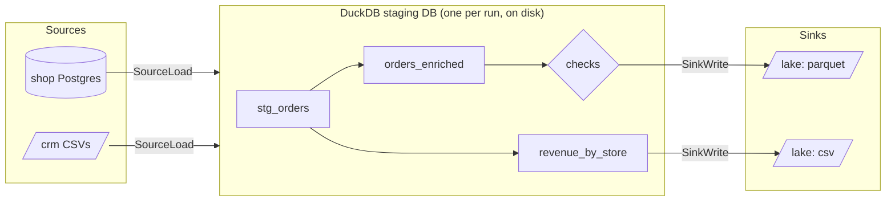

Nine chapters of concepts deserve a payoff. This chapter introduces **PipelineZ** (`pz`) - a
small, dbt-inspired batch ETL tool for .NET, powered by DuckDB - and rebuilds Sunrise
Bakery's pipeline with it, for real. As we go, watch how each idea from Part I shows up as a
concrete feature: this chapter is deliberately a reunion tour.

One framing sentence to hold onto: **a pz project is one `connections.yml` (the places your
data lives, with credentials) plus SQL files (the transformations, and the reads and writes
they perform)** - and `pz` compiles those files into a dependency-ordered DAG and executes
it. No server, no database to administer, nothing that isn't checked into git.

## Installing and scaffolding

`pz` installs as a standard .NET global tool and scaffolds a complete, runnable project:

```console
$ dotnet tool install --global Pz.Cli --prerelease
$ pz init sunrise
$ cd sunrise && pz run --all
```

The scaffold runs offline against bundled CSVs in seconds - Chapter 9's "tiny sample
project" habit, built into the first command you learn.

## The core concepts

`pz`'s vocabulary is small, and every term maps onto Part I:

- **Connection** - a *place* with credentials: a folder of CSVs, a Postgres database, an S3
  bucket, a SQL Server. Declared once in `connections.yml`.
- **Entity** - a named thing in that place, named *the way the place names it*: a table
  `dbo.orders`, a file pattern, an API resource.
- **Direction** - reading and writing aren't different kinds of config; they're different
  *function calls* against the same connection: `source()` reads an entity, `sink()` writes
  one. One connection can be both read and written.
- **Pipeline** - one SQL file under `pipelines/`, producing one table named after the file.
- **Check** - a data-quality assertion attached to a pipeline (Chapter 7's one-liners).
- **DAG, nodes, runs** - exactly Chapter 6's objects, made executable. There are four node
  kinds: **SourceLoad** (land a dataset), **Pipeline** (run one SQL step), **Check** (run
  one assertion), **SinkWrite** (write one output).

## Sunrise Bakery in five files

Here's the bakery's pipeline, complete. First, the places:

```yaml
# connections.yml - every place pz talks to, declared once
shop:
  connector: postgres
  host: ${SHOP_DB_HOST}          # secrets come from the environment (Chapter 9)
  database: shop
  entities:
    orders:
      read:
        columns: { id: bigint, customer_id: bigint, store_id: bigint,
                   amount: double, status: varchar, updated_at: timestamp }

crm:
  connector: localfiles          # the CRM's nightly CSV export drop
  root: exports/crm

lake:
  connector: localfiles          # where results land; every write goes under this root
  root: out
```

Then the transformations - Chapter 5's layers, as SQL files:

```sql
-- pipelines/stg_orders.sql  (staging: clean, no business logic)
select id, customer_id, store_id, amount, lower(status) as status, updated_at
from {{ source('shop', 'orders') }}
where status <> 'test'
```

```sql
-- pipelines/orders_enriched.sql  (join to customers; write curated parquet)
INSERT INTO {{ sink('lake', 'orders_curated', format: 'parquet', strategy: 'replace') }}
select o.id, o.amount, o.status, c.email, c.region
from {{ ref('stg_orders') }} as o
join {{ source('crm', 'customers', format: 'csv',
               columns: { id: 'bigint', email: 'varchar', region: 'varchar' }) }} as c
  on c.id = o.customer_id
```

```sql
-- pipelines/revenue_by_store.sql  (mart: the owner's Monday answer)
INSERT INTO {{ sink('lake', 'revenue_by_store', format: 'csv', strategy: 'replace') }}
select store_id, date_trunc('day', updated_at) as day, sum(amount) as revenue
from {{ ref('stg_orders') }}
where status = 'shipped'
group by store_id, day
```

And the checks, one small YAML next to the pipeline they guard:

```yaml
# pipelines/configs/orders_enriched.yml
pipeline: orders_enriched
checks:
  - not_null: [id, email]
  - unique: [id]
```

Three things worth noticing before we run it:

- **The SQL is the whole story.** Extract (`source()` in the FROM), transform (the SELECT),
  load (`INSERT INTO {{ sink(...) }}`) - one file names all three. A file with no
  `INSERT INTO` (like `stg_orders`) is an intermediate step that others consume via
  `ref()`.
- **The DAG comes from those calls.** Chapter 6 argued dependencies should be *derived from
  the code, not declared beside it* - `pz` builds the graph from the `ref()`/`source()`/
  `sink()` calls at template-render time. It never guesses by parsing your SQL.
- **Every read option has two homes, never both.** `orders`' columns live in
  `connections.yml` (two pipelines might want it stable); the CRM read is declared entirely
  at its call site, where its only reader lives. Declaring the same option in both places
  is a hard error (`PZ0341`) - there is no "effective config" to puzzle over.

## What happens when you run it

```console
$ pz run revenue_by_store
ok src_shop__orders 4812 rows 412ms
ok src_crm__customers 1893 rows 96ms
ok stg_orders 4655 rows 11ms
ok orders_enriched 4655 rows 24ms
ok check_orders_enriched_not_null_id_email 0 rows 7ms
ok check_orders_enriched_unique_id 0 rows 5ms
ok revenue_by_store 87 rows 19ms
ok lake.orders_curated 4655 rows 130ms
ok lake.revenue_by_store 87 rows 40ms
run <runId>: 9 succeeded, 0 failed, 0 skipped
```

Every line is one DAG node finishing. Under the hood, `pz` is a **hub-and-spoke** machine
with DuckDB as the hub - the "warehouse-in-a-file as workbench" idea from Chapters 2 and 5:



Sources land data into a disk-backed DuckDB database (`.pz/runs/<id>/staging.duckdb`),
pipelines transform *inside* DuckDB at columnar speed, and sinks drain results out.
Independent nodes run in parallel; execution is always *materialize, then drain* - even the
`INSERT INTO` form stages the table first and writes atomically, so a half-failed run never
leaves a half-written destination (Chapter 4's replace-safely rule).

`pz run <name>` runs one *flow* - that node plus everything upstream and downstream. On a
project with several independent flows, bare `pz run` refuses (so you never run the world
by accident) and `--all` is the explicit everything.

## The reunion tour: Part I, feature by feature

**Ingestion (Chapter 4).** Talking to a new source is a *connector* - first-party ones
cover local files, Postgres, SQL Server, S3, Azure Blob, and HTTP APIs, and there's a
documented ABI for writing your own. `pz` pushes work down to capable sources: it uses
DuckDB's own SQL parser to extract which columns and filters your pipeline actually needs
and hands them to the connector (*ReadHints*), so `select id, amount ... where updated_at >`
becomes a narrow query at the source, not a full-table drag. Failures are classified
transient-or-permanent, and transient ones retry with backoff - tunable per call:
`source('shop', 'orders', retry: { max_attempts: 3 })`.

**Incremental and CDC (Chapters 3–4).** Going incremental is one line *in the SQL*:

```sql
from {{ source('shop', 'orders') }}
where updated_at > {{ watermark('shop', 'orders') }}
```

That comparison *is* the declaration - `pz` reads it (again via DuckDB's parser, not
regex), types the cursor from the stored watermark, and has the connector fold the
condition into extraction. The watermark advances **only after every downstream sink write
commits** - Chapter 4's deliver-first-then-advance rule, enforced by the engine rather than
by your discipline. `pz state show/rollback/set/clear` gives you Chapter 8-style visibility
and Chapter 3-style rebuild-from-scratch control over that memory. For deletes and
cursor-less tables, `sync: { mode: cdc }` reads Postgres or SQL Server change logs - each
run drains what changed since the last run's position, with `on_delete: delete|soft|ignore`
deciding what a source delete does downstream. Backfill safety is first-class too: bounded
windows (`initial` / `max_window` / `until`) slice big history into Chapter 3's gentle
pieces, with per-source concurrency caps and a circuit breaker for the truly bad night.

**Delivery guarantees (Chapter 4).** Sink strategies are exactly the three you know -
`replace`, `append`, `merge` (with `keys:`) - and the guarantee matrix is a stability
contract: merge and replace are effectively-once; append is at-least-once. Here's the
detail that shows the philosophy: pairing an incremental read with a plain append is a
*compile error* (`PZ0214`) unless you explicitly write `duplicates: accept`. The tool makes
you sign for the double-counting risk in code review, where Chapter 9 said such decisions
belong.

**Transformation (Chapter 5).** Layers are just `ref()` chains; the engine is DuckDB, so
the SQL is real analytical SQL over columnar data. Determinism is a project-wide rule -
run artifacts are byte-stable, which makes Chapter 9's diff-before-deploy an actual diff.

**Orchestration (Chapter 6).** Recall that chapter's split: orchestration is two separate
jobs - deciding *in what order* the steps run, and deciding *when* a run starts. `pz`
builds in the first job completely: it sorts the DAG into dependency order, runs
independent branches in parallel, and skips exactly the downstream cone of a failed node.
The second job is deliberately *not* built in - you start `pz run` from whatever time-based
scheduler you already have (cron, Windows Task Scheduler, a CI job on a timer). In
Chapter 6's terms, `pz` is the one-command-that-runs-the-DAG half of the honest small-team
architecture, and your existing scheduler is the other half. The morning-after story is `pz retry`: it re-executes only what didn't
succeed, *reuses the failed run's already-landed source data* where it's provably safe
(falling back to re-extraction with a note when not), and carries already-committed sink
writes forward - the 4-minute rerun instead of the 40-minute one.

**Validation (Chapter 7).** Checks are DAG nodes; a failed check blocks its downstream
sink write, so unvalidated data structurally can't reach the dashboard. Beyond runtime
checks, `pz validate` runs tiers of *pre-run* validation - config, templates, DAG shape,
and your rendered SQL against DuckDB's own parser - and reports **all** errors at once,
each with a `PZ####` code naming the file, the cause, and a next step. `pz validate
--connect` adds live connectivity and schema-drift probes: Chapter 4's drift, caught at 3
p.m. instead of 3 a.m.

**Monitoring (Chapter 8).** Every run emits one event stream, rendered as console lines or
as NDJSON (`--log-format json`) under a documented, append-only contract - Chapter 8's
structured events, ready for whatever watches your ops world. Run history persists as
`run_results.json` per run; metrics flow through OpenTelemetry (including a
`pz.run.completed` metric for the did-it-even-run heartbeat); exit codes are the honest
machine-readable signal (0 ok, 1 node failures, 2 config error, 3 fatal). Old runs'
staging databases are swept automatically by a retention policy, and for ephemeral hosts
(containers that vanish after each run) the state and run history can live in a SQL
Server-backed store instead of local disk.

**Best practices (Chapter 9).** Mostly, `pz` makes the checklist the path of least
resistance: everything is files in git; loads are staged and atomic; secrets are `${ENV}`
references that never appear in logs or artifacts; the scaffold ships a runnable sample;
`pz plan` and `pz compile` let you inspect the graph and strategies without touching data.

## The CLI at a glance

| Verb | What it does |
|---|---|
| `pz init` / `pz restore` | Scaffold a project / fetch declared connector packages |
| `pz validate [--connect]` | All pre-run validation, aggregated; optionally probe sources live |
| `pz compile` / `pz plan` | Build the DAG / print per-node execution strategy - no execution |
| `pz run [name \| --all]` | Execute a flow, or everything |
| `pz test` | Run only the checks (and what they need) |
| `pz retry` | Re-run only what failed, reusing safe staged data |
| `pz ls` / `pz connectors` | List nodes in topological order / list connectors |
| `pz state …` / `pz cdc …` / `pz clean` | Inspect and manage watermarks, CDC positions, and old runs |

## The takeaway

`pz` is Part I with the boilerplate removed: connections declared once, ETL written as SQL
whose own `source()`/`ref()`/`sink()` calls *are* the DAG, checks as one-liners that gate
the outputs, watermarks and delivery guarantees enforced by the engine, and a run that
tells its story as structured events. What it deliberately *doesn't* try to be is the
subject of the final chapter - and knowing that boundary is part of using it well.

---

*Next: [Chapter 11 - What pz doesn't do](../11-pz-limitations/)*
