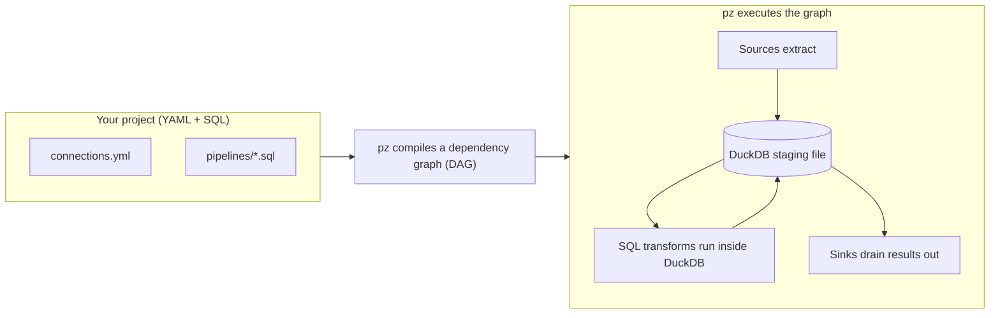
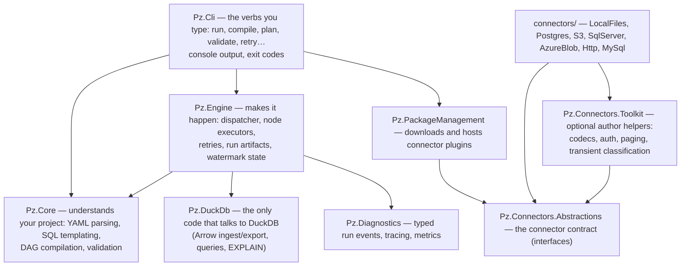
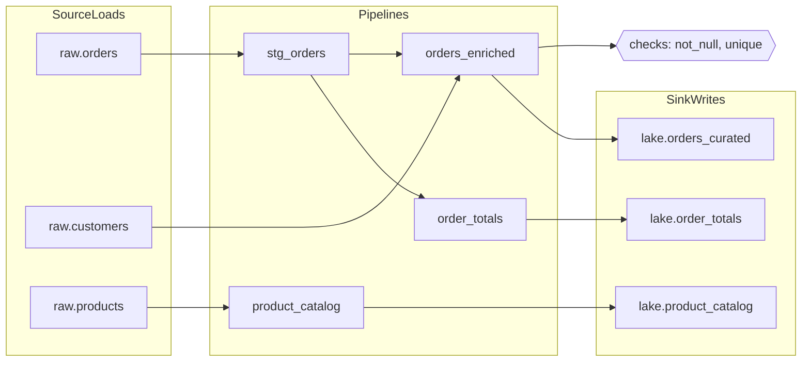
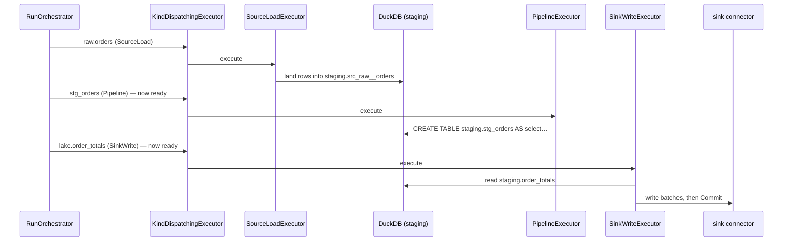

This page is for someone who understands *what* PipelineZ does but gets lost in the *code*.
It follows one `pz run` from the keystroke to the output files, step by step, naming the
actual classes and files at every stop, using the starter project that `pz init` creates as
the running example. No prior knowledge of the internals is assumed.

If you haven't used `pz` yet, do the [quickstart](/quickstart/) first — this tour is much
easier to follow after you've run it once. The vocabulary lives in
[Key concepts](/concepts/key-concepts/); this page repeats the important bits in place so you don't
have to jump around.

## 1. The mental model in 30 seconds

PipelineZ is a build tool for data, the way `make` or dbt are build tools for code:

- You **describe** your data in small files: YAML for "where data comes from" (sources) and
  "where results go" (sinks), SQL for "how to transform it" (pipelines).
- `pz` **compiles** those files into a dependency graph — "load orders before you can filter
  them, filter them before you can total them" — and figures out the correct order itself.
- `pz` **executes** that graph using an embedded [DuckDB](https://duckdb.org) database as the
  workbench: sources land raw data *into* DuckDB, your SQL runs *inside* DuckDB, sinks drain
  the results *out* of DuckDB.

That's the whole machine. Everything else in the codebase is making those three steps safe,
fast, observable, and resumable.



## 2. The example project

Running `pz init my-project` scaffolds this:

```text
my-project/
├── project.yml                      # project name, connectors, vars, engine settings
├── connections.yml                  # every place pz talks to, and each one's entities
├── pipelines/
│   ├── stg_orders.sql               # transform: filter raw orders
│   ├── orders_enriched.sql          # transform: join orders with customers → sink
│   ├── order_totals.sql             # transform: aggregate → sink
│   ├── product_catalog.sql          # transform: passthrough → sink
│   └── configs/
│       └── orders_enriched.yml      # per-pipeline options: materialization, checks
└── data/                            # CSVs so the example runs offline
```

Walk through each file:

**`connections.yml`** declares *every place pz talks to*. A connection has a **connector** (the
plugin that knows how to talk to a kind of system — here `localfiles`, which reads local
CSV/Parquet/NDJSON) and **entities** (the individual tables/files it exposes). Direction is the function
a pipeline calls, not the block you declared, so one connection can be both read and written:

```yaml
raw:
  connector: localfiles
  entities:
    orders:
      read:
        path: data/orders.csv
        format: csv
        columns:
          id: bigint
          customer_id: bigint
          amount: double
          status: varchar
```

**`pipelines/stg_orders.sql`** is a transformation. It is plain SQL plus a few
double-brace template calls:

```sql
select
    id,
    customer_id,
    amount,
    status
from {{ source('raw', 'orders') }}
where amount >= {{ var('min_amount') }}
```

Those `{{ ... }}` calls are the most important idea in the whole project, so read this twice:
**the template calls are how `pz` learns the dependency graph.** `pz` never parses your SQL
to guess what it reads. When it renders this file, the call `source('raw', 'orders')`
does two jobs at once: it *returns* the name of the table the data will be in, and it
*records* "this pipeline depends on the `orders` dataset of source `raw`".

| Template call | Plain meaning | Renders to |
|---|---|---|
| `{{ source('raw', 'orders') }}` | "I read this source dataset" | the staging table the source lands into |
| `{{ ref('stg_orders') }}` | "I read that other pipeline's output" | the staging table/view that pipeline produces |
| `{{ sink('lake', 'order_totals') }}` | "my result feeds this sink output" | (declares the edge; the compiler handles the rest) |
| `{{ var('min_amount') }}` | "paste in this project variable" | the value from `project.yml` `vars:` (here `10`) |

**`pipelines/order_totals.sql`** shows the sink call — a pipeline can read like one
complete extract-transform-load statement:

```sql
INSERT INTO {{ sink('lake', 'order_totals') }}
select customer_id, sum(amount) as total
from {{ ref('stg_orders') }}
group by customer_id
```

Note there is no `INSERT` at run time — the compiler strips the `INSERT INTO {{ sink(...) }}`
wrapper and keeps only the `select`. Execution is always "materialize the select into a
staging table, then a separate step drains that table into the sink" (see §6). The inline
form is sugar for declaring the pipeline→sink edge in one readable file.

**`pipelines/configs/orders_enriched.yml`** carries per-pipeline options that don't belong in
SQL — how to materialize, and data-quality **checks**:

```yaml
pipeline: orders_enriched
materialization: table
tags: [daily]
checks:
  - not_null: [id, email]
  - unique: [id]
```

The `lake` connection is *where results go* — just a place with credentials. What to write and
how (`strategy`, `keys`, `format`, `path`) rides the `sink()` call in the pipeline that writes it,
or an `entities: <e>: write:` block here — never both (PZ0341).

## 3. The map of the code

The solution is layered, and the layering is strict: each project may only reference the ones
below it. If you remember one rule about where code lives, remember this diagram:



In plain terms:

| Project | One-line job | Start reading at |
|---|---|---|
| `src/Pz.Cli` | Defines each verb, parses arguments, prints output, returns exit codes. Thin — real work is delegated down. | `Commands/RunCommand.cs` |
| `src/Pz.Core` | Turns files on disk into an in-memory `PzProject`, renders SQL templates, builds the DAG. Knows nothing about executing. | `Loading/ProjectLoader.cs`, `Dag/DagCompiler.cs` |
| `src/Pz.Engine` | Runs a compiled DAG: dispatches nodes, moves data, retries failures, writes run artifacts. | `Dispatch/RunOrchestrator.cs`, `Execution/` |
| `src/Pz.DuckDb` | Wraps the DuckDB native library behind an interface. Nothing else in the repo touches DuckDB directly. | `DuckSession` |
| `src/Pz.PackageManagement` | Resolves connector NuGet packages, writes `pz.lock.json`, loads each connector into its own isolated plugin context. | `Hosting/`, `Restore/` |
| `src/Pz.Connectors.Abstractions` | The interfaces every connector implements (`ISourceConnector`, `ISink`, …). The contract of the ecosystem — changes here are additive-only. | the interfaces themselves |
| `src/Pz.Diagnostics` | One typed event stream that both the console renderer and the NDJSON log are views of, plus OpenTelemetry plumbing. | `Events/RunEvent.cs` |
| `connectors/` | The first-party connectors, each also a worked example of the ABI. | `connectors/Pz.Connector.LocalFiles` |

## 4. Every command walks the same eight phases

Every verb runs the same rails and just stops at a different station:

```text
load → restore-check → compile → validate → plan → execute → finalize → report
```

- `pz compile` stops after **compile** (writes `.pz/target/manifest.json`).
- `pz plan` stops after **plan** (writes `.pz/target/plan.json`).
- `pz validate` runs the validation tiers and stops.
- `pz run` (and `pz test`, `pz retry`) go all the way to **report**.

This is why the codebase feels repetitive at the top of each `*Command.cs` file — every verb
begins with the same `ProjectLoader.Load(...)` → `DagCompiler.Compile(...)` prelude. That
repetition is the design: one set of rails, verbs differ only in how far they ride them.

## 5. Phase by phase: what happens when you type `pz run`

The rest of this tour follows `pz run` in the example project. The orchestrating code is
`RunCommand.ExecuteRun` in `src/Pz.Cli/Commands/RunCommand.cs` — it is long but linear, and
reads exactly in the order below.

### Phase 1: load — files become a `PzProject`

`ProjectLoader.Load` (`src/Pz.Core/Loading/ProjectLoader.cs`) reads `project.yml`,
`connections.yml`, and every file under `pipelines/`, and turns them into one immutable in-memory
record: `PzProject`. Environment variables are interpolated, `vars:` defaults are applied.

If anything is wrong — unknown key, missing required field, bad duration string — loading
does **not** stop at the first problem. Errors are collected and thrown together as a
`PzValidationException` holding a list of `PzError`s, each with a stable `PZ####` code, the
file it came from, and a suggested next step. You'll see this "aggregate, never
fail-one-at-a-time" pattern everywhere; it's a project-wide rule.

### Phase 2: restore-check — are the connectors here?

Connectors are plugins. The seven first-party ones (LocalFiles, Postgres, S3, SqlServer,
AzureBlob, Http, MySql) are built into the `pz` tool itself; third-party ones are NuGet packages that
`pz restore` downloads into `.pz/packages` and pins in `pz.lock.json`.

`ConnectorRegistryFactory.CreateAsync` checks that every connector the project declares is
available and loads each non-builtin one into its own **`AssemblyLoadContext`** — think "a
private classloader per plugin", so one connector's dependency versions can never clash with
another's or with the engine's. The result is a `ConnectorRegistry` the engine can ask for
connector instances by name.

### Phase 3: compile — files become a graph

`DagCompiler.Compile` (`src/Pz.Core/Dag/DagCompiler.cs`) is the heart of Pz.Core. For the
example project it:

1. **Renders every pipeline's SQL** with the Scriban template engine (sandboxed — only the
   whitelisted functions from §2 exist). Rendering `stg_orders.sql` produces real SQL:

   ```sql
   select id, customer_id, amount, status
   from staging.src_raw__orders
   where amount >= 10
   ```

   and, as a side effect, records the dependency "stg_orders needs source raw.orders".

2. **Builds nodes.** There are exactly four node kinds, and every run is made only of these:

   | Node kind | Plain meaning | Executed by |
   |---|---|---|
   | `SourceLoad` | "land dataset X of source Y into a staging table" | `SourceLoadExecutor` |
   | `Pipeline` | "run this rendered SQL inside DuckDB" | `PipelineExecutor` |
   | `Check` | "run this assertion query; fail if it finds bad rows" | `CheckExecutor` |
   | `SinkWrite` | "drain that staging table into sink output Z" | `SinkWriteExecutor` |

3. **Gives every node a stable, content-addressed ID** — a hash of what the node *is*, not
   when it was compiled. Same inputs, same ID, every time. This is what lets `pz retry` and
   incremental watermarks recognize "the same node" across runs.

4. **Topologically sorts** the nodes (Kahn's algorithm, `TopologicalSortOrThrow`) so
   dependencies always come before dependents, with deterministic tie-breaking. If your
   `ref()` calls form a loop, this is where you get the `dependency cycle: a -> b -> a`
   error instead of a hang.

The compiled DAG for the example project looks like this (this is what `pz compile` +
`.pz/target/manifest.json` describe):



Note what created every arrow: a `source()`, `ref()`, or `sink()` call in a `.sql` file, or a
`checks:` entry in a config file. Nothing else.

### Phase 4: validate — catch problems before moving any data

`pz validate` (and `pz run` on its way through) checks in tiers, cheapest first: YAML shape,
then compile/graph coherence, then each connector validates its own config, then the
**SQL dry-compile** — every rendered pipeline is `EXPLAIN`ed against empty tables built from
the declared column types, so DuckDB itself catches typos, unknown columns, and type errors
without touching a single data row. See [Validation and errors](/concepts/validation/) for the full
tier list.

### Phase 5: plan — decide *how* each edge moves data

Here's a fact that surprises most people reading the code: **there are two different ways
data physically moves**, and `ExecutionPlanner` (`src/Pz.Engine/Planning/`) picks one per
edge:

| Strategy (as shown by `pz plan`) | Plain meaning |
|---|---|
| `native_scan` | The connector hands DuckDB a SQL fragment like `read_csv('data/orders.csv')` and DuckDB reads the data *itself*. The bytes never pass through .NET at all. Fastest. |
| `native_copy` | Same idea on the way out: DuckDB's `COPY` statement writes the output file directly. |
| `arrow_stream` | The universal fallback: the connector streams the data through .NET as Arrow record batches (see §7). Works for any connector. |
| `duck_sql` | The edge is just SQL inside DuckDB (pipeline reading a staging table). |

Run `pz plan` in the example project and you'll see each node's chosen strategy **and the
reason why** — the planner never decides silently. The same table is persisted to
`.pz/target/plan.json`, along with a computed memory budget, so "how much RAM does this run
need" has an answer before anything runs.

### Phase 6: execute — the graph actually runs

This is the biggest phase; it gets its own section (§6).

### Phase 7: finalize — write down what happened

Two artifacts matter:

- **`.pz/runs/<run-id>/run_results.json`** — one entry per node: status, rows moved,
  duration, error if any. It is written *incrementally after every node completes*
  (`SnapshotRunEvents` → `RunResultsWriter`), not once at the end — so even if the process
  is killed mid-run, `pz retry` can see exactly which nodes had finished.
- **`.pz/state/watermarks.json`** — the incremental-load bookmarks (§8). Deliberately the
  *very last* write of the run.

The staging database outlives the run — every run, success or failure. That's what `pz retry`
copies already-landed source tables back out of, so the source system isn't contacted twice for
data it already delivered. Automatic retention (`retention:` in `project.yml`, on by default at
`keep_last: 10`) deletes `staging.duckdb` from runs past that window at the end of every run,
staging-only — `run_results.json` is always kept. Set `retention: off` to disable it.
[`pz clean`](/reference/cli/) remains the on-demand verb, and the only way to purge whole run
directories or select by age; it too keeps the newest run's staging so `pz retry` stays usable.

### Phase 8: report — the summary and exit code

One summary line —

```text
run 20260716T091500123Z-3f2a: 9 succeeded, 0 failed, 0 skipped (.pz/runs/.../run_results.json)
cleaned 3 staging database(s) and 0 stale workdir(s) — freed 1.2 GB
```

The `cleaned …` line is automatic retention reporting what it swept (§7 above).

— and an exit code with fixed meaning: **0** all good, **1** some nodes failed, **2** your
config/SQL is invalid (nothing ran), **3** fatal (crash or cancellation). Scripts and CI can
branch on these.

## 6. Inside execute: the dispatcher and the four executors

### The staging database

The first thing `ExecuteRun` does is create the run directory and open the hub:

```text
.pz/runs/<run-id>/staging.duckdb
```

`DuckSession.Open(...)` opens that file and creates a schema named `staging` in it. Every
intermediate table of the run lives there, on disk (so datasets bigger than RAM are fine —
DuckDB spills), named predictably (`StagingNames` in `SinkWriteExecutor.cs`):

- a source landing: `staging.src_raw__orders`
- a pipeline's output: `staging.stg_orders`

One detail worth knowing early because it's counterintuitive: the whole run shares **one**
DuckDB connection, serialized by a `SemaphoreSlim`. Parallelism does not come from parallel
connections — it comes from the dispatcher overlapping *different kinds of work* (one node
extracting from Postgres while another writes Parquet while DuckDB crunches a third).

### The dispatcher

`RunOrchestrator.ExecuteAsync` (`src/Pz.Engine/Dispatch/RunOrchestrator.cs`) is an
event-driven dispatcher, not a loop. In plain terms:

1. Every node knows how many dependencies it's still waiting for (a counter).
2. All nodes with counter 0 start immediately (up to `engine.threads` at once — a global
   `SemaphoreSlim` is the ticket booth).
3. When a node finishes successfully, it decrements each child's counter; any child that
   hits 0 is dispatched right then.
4. When a node **fails**, every descendant is marked `Skipped` (`CascadeSkip`) — never run on
   top of missing input. Siblings elsewhere in the graph keep running (unless `--fail-fast`).
5. When the outstanding-work counter drains to zero, the run is over; every node in the run
   is guaranteed to end with exactly one result: `Success`, `Failed`, or `Skipped`.

Each dispatched node goes to `KindDispatchingExecutor`, which is nothing more than a
switch on the node kind that hands off to the right executor — plus the shared wrapping
every node gets: engine-level **retries** for transient connector errors, and error
wrapping so an executor exception becomes a `Failed` result instead of killing the run.



### What each executor actually does

**`SourceLoadExecutor`** (`src/Pz.Engine/Execution/SourceLoadExecutor.cs`) — asks the
registry for the source connector, opens it, and lands the dataset into its staging table.
On the `native_scan` plan it just runs the connector-provided SQL fragment inside DuckDB; on
the universal plan it runs two overlapped tasks — the connector *extracting* Arrow batches
and DuckDB *ingesting* them — connected by a bounded channel (a fixed-size conveyor belt: if
DuckDB falls behind, the belt fills up and extraction naturally pauses; that's backpressure).
For an incremental source, the connector also ANDs `cursor > <last watermark>` into its
extraction query (§8).

**`PipelineExecutor`** (`Execution/PipelineExecutor.cs`) — the simplest one: execute the
rendered SQL inside DuckDB as `CREATE TABLE staging.<name> AS <select…>` (or a view,
depending on `materialization:`). A pipeline marked `ephemeral` never gets its own node at
all — the compiler inlines its SQL into each consumer as a CTE.

**`CheckExecutor`** (`Checks/CheckExecutor.cs`) — turns each `checks:` entry into an
assertion query against the pipeline's staging table (e.g. `unique: [id]` → "count rows where
`id` appears more than once"). In the example project the two entries in
`orders_enriched.yml` become two nodes named `check_orders_enriched_not_null_id_email` and
`check_orders_enriched_unique_id`, each depending on the `orders_enriched` pipeline node. Any
offending rows → the check node fails, the run reports failure (exit code 1), and up to five
offending values are recorded in `run_results.json` to help you find the bad data. Note the
graph shape in §5: a check hangs *off* its pipeline as a sibling of the sink write — it is an
alarm, not a gate, so the sink write (which depends only on the pipeline) still runs.
`pz test` is simply a run whose selection is "all Check nodes plus their ancestors".

**`SinkWriteExecutor`** (`Execution/SinkWriteExecutor.cs`) — drains a staging relation out
through the sink connector. The universal path is a session with a strict lifecycle:
`BeginWriteAsync` → many `WriteBatchAsync` → exactly one of `CommitAsync` **or**
`AbortAsync`, never both. Commit-or-abort is what makes `replace`/`merge` outputs land
all-or-nothing (see [Delivery guarantees](/concepts/delivery-guarantees/)). On the `native_copy` plan
it instead issues one DuckDB `COPY` statement that writes the file directly.

## 7. Arrow in one paragraph

Everywhere data crosses between a connector and the engine it travels as an **Apache Arrow
`RecordBatch`**: a few thousand rows in a columnar memory layout that DuckDB, .NET, and every
serious data tool agree on. Because everyone agrees on the byte layout, handing a batch from
a connector to DuckDB is **zero-copy** — a pointer changes hands; the values are never
re-marshaled one by one. The price of that speed is strict ownership rules (who is allowed to
free the buffer, and when) — the ABI defines them, and `Pz.Connectors.TestKit` exists largely
to catch connectors that break them, because use-after-free bugs in pooled native memory are
the worst bugs in this codebase.

## 8. Watermarks: incremental loads in plain terms

A watermark is a bookmark: "for `raw.orders`, I have already loaded everything up to
`updated_at = 2026-07-15 23:10:04`". They live in `.pz/state/watermarks.json`, managed by
`WatermarkStore` (`src/Pz.Engine/State/`) and repaired by `pz state`.

The lifecycle, in order:

1. **Read**: an incremental source's extraction adds `where cursor > <bookmark>` — only new
   rows are pulled.
2. **Compute**: after landing, the engine computes `MAX(cursor)` over what actually arrived
   in staging — the candidate new bookmark.
3. **Advance — only when it's safe**: `WatermarkAdvancement.Advance` runs as the *last*
   action of the run and moves the bookmark only if **every** sink write downstream of that
   source committed. If a sink failed, the bookmark stays put, so the next run re-extracts
   the same rows rather than silently losing them. Losing a little time is fine; losing rows
   is not.

## 9. What you see on screen (and in logs)

Executors never call `Console.WriteLine`. They report progress through one typed event
stream (`IRunEvents` → `RunEventBus`, contract in [docs/events.md](/events/)), and what
you *see* is a renderer subscribed to that stream:

- default: `LiveTreeRenderer`, the live progress tree in your terminal;
- `--log-format json`: `JsonRenderer`, one NDJSON object per line, for machines and CI.

Same events, two views. The crash-safe `run_results.json` writer (§5, phase 7) is registered
*directly* on the event fan-out, not through the renderer machinery — a hung or broken
renderer can never corrupt the run record.

## 10. A reading path

If you want to internalize the codebase, read in this order — each file is self-contained
enough to read top to bottom, and heavily commented with the *why*:

1. `src/Pz.Cli/Templates/init/` — the example project itself (you now know what each file means).
2. `src/Pz.Cli/Commands/RunCommand.cs` — `ExecuteRun` is the spine of this whole tour.
3. `src/Pz.Core/Dag/DagCompiler.cs` — files → nodes → sorted DAG.
4. `src/Pz.Engine/Dispatch/RunOrchestrator.cs` — the dispatcher from §6.
5. `src/Pz.Engine/Execution/SourceLoadExecutor.cs` and `SinkWriteExecutor.cs` — the data plane in practice.
6. `docs/concepts/architecture-overview.md` — the decision log: *why* it's built this way.

And keep [`docs/diagrams/`](/diagrams/) open — four presentation-grade diagrams of
exactly the mechanisms this page walked through.

## Glossary

| Term | Plain meaning |
|---|---|
| **DAG** | Directed acyclic graph — boxes and arrows with no loops. Here: nodes are units of work, arrows mean "must finish first". |
| **Node** | One dispatchable unit of work. Exactly four kinds: SourceLoad, Pipeline, Check, SinkWrite. |
| **Connector** | A plugin that knows how to talk to one kind of external system (files, Postgres, S3, …). Implements the interfaces in `Pz.Connectors.Abstractions`. |
| **Source / dataset** | A configured connection for reading (`raw`) / one table-like thing it exposes (`orders`). |
| **Sink / output** | A configured connection for writing (`lake`) / one destination it exposes (`order_totals`). |
| **Staging** | The run's private DuckDB file where all intermediate tables live: `.pz/runs/<id>/staging.duckdb`. |
| **Materialization** | How a pipeline's result is stored in staging: `table`, `view`, or `ephemeral` (inlined into consumers as a CTE). |
| **Arrow RecordBatch** | A chunk of rows in the columnar in-memory format all components exchange zero-copy. |
| **Watermark** | The saved bookmark of how far an incremental source has been loaded. |
| **ABI** | The versioned connector contract (interfaces + rules). Changes are additive-only so old connectors keep working. |
| **ALC (`AssemblyLoadContext`)** | .NET's isolated plugin loader — one per connector package, so dependency versions can't clash. |
| **PZ#### code** | Stable identifier on every user-facing error, e.g. `PZ0214`. Grep for it in the codebase to find exactly where it's raised. |
